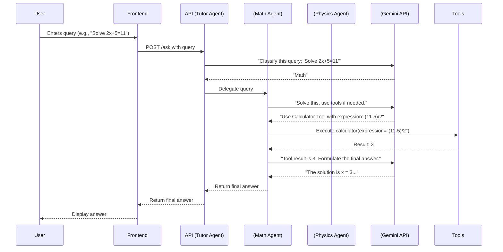

# AI Tutor: A Multi-Agent System with Gemini

This project implements an AI-powered tutoring assistant based on a multi-agent architecture. The main "Tutor Agent" routes student queries to specialized "sub-agents" for Mathematics and Physics. These sub-agents leverage Google's Gemini Pro API and specialized tools to provide accurate answers.

**Live Application URL:** [**You will replace this with your Vercel deployment URL**]

---

## 🏛️ Architecture

This project is designed using the principles of a multi-agent system, emphasizing modularity, delegation, and tool usage.

1.  **Tutor Agent (Orchestrator)**: This is the user's primary point of contact. It receives a natural language query and its sole responsibility is to determine the nature of the query. It uses a call to the Gemini API for **intent classification** to decide whether the query is related to "Math", "Physics", or is a general question.

2.  **Specialist Sub-Agents**:
    * **Math Agent**: Handles all mathematical questions. It is equipped with a **Calculator Tool** to perform precise arithmetic operations. It uses Gemini's function-calling capability to decide when to use the calculator.
    * **Physics Agent**: Handles all physics-related questions. It is equipped with a **Constants Lookup Tool** to fetch precise values of physical constants (e.g., the speed of light).

3.  **Tool Usage**: The agents are designed to be "tool-aware." When a specialist agent believes a tool is necessary, it communicates this back to the application logic, which executes the corresponding Python function. The result is then fed back to the agent to formulate the final, accurate response.

4.  **API & Frontend**: The backend is a **FastAPI** application that exposes a single endpoint (`/ask`). A minimalist HTML/JavaScript frontend provides a simple user interface to interact with the Tutor Agent.

### Interaction Flow



---

## 🚀 Deployment

The application is deployed on **Vercel**. Vercel provides a seamless experience for deploying serverless functions, including Python FastAPI backends.

The `vercel.json` file in the repository configures Vercel to install the Python dependencies from `requirements.txt` and run the FastAPI application using the ASGI server `uvicorn`.

### Secure API Key Handling

The `GOOGLE_API_KEY` is not hardcoded.
* **Local**: It's loaded from a `.env` file (which is git-ignored).
* **Deployment**: It's set as an **Environment Variable** in the Vercel project settings, ensuring it remains secure.

---

## 🛠️ Local Setup & Execution

Follow these steps to run the project on your local machine.

### Prerequisites

* Python 3.9+
* A Google Gemini API Key: Get one from [ai.google.dev](https://ai.google.dev/).

### 1. Clone the Repository

```bash
git clone [YOUR_REPOSITORY_URL]
cd [YOUR_REPOSITORY_NAME]
```

### 2. Set Up a Virtual Environment

It's best practice to use a virtual environment.

```bash
# For Unix/macOS
python3 -m venv venv
source venv/bin/activate

# For Windows
python -m venv venv
.\venv\Scripts\activate
```

### 3. Install Dependencies

```bash
pip install -r requirements.txt
```

### 4. Configure Environment Variables

Create a file named `.env` in the root of the project directory and add your Gemini API key:

```
GOOGLE_API_KEY="YOUR_GEMINI_API_KEY_HERE"
```

### 5. Run the Application

Use `uvicorn` to run the FastAPI server.

```bash
uvicorn app.main:app --reload
```

The `--reload` flag automatically reloads the server when you make code changes.

### 6. Access the Application

* **API**: Open your browser or a tool like Postman and go to `http://127.0.0.1:8000/docs` to see the auto-generated API documentation and test the `/ask` endpoint.
* **Web Interface**: Open `http://127.0.0.1:8000` in your browser to use the simple web UI.

---

## 💡 Challenges & Solutions

**Challenge:** Reliably determining the user's intent (Math vs. Physics). Simple keyword matching is brittle. For example, "What is the velocity..." could be a conceptual physics question or a math word problem.

**Solution:** I implemented an explicit classification step. The Tutor Agent makes a dedicated, lightweight call to the Gemini API with a system prompt that asks it to classify the query into one of the predefined categories. This is far more robust and scalable than regex or keyword searching.

**Challenge:** Ensuring the LLM uses tools correctly and doesn't just hallucinate calculations.

**Solution:** By using Gemini's built-in function-calling feature, we delegate the decision of *when* to use a tool to the model itself. We define the schema of our Python tools, and the model requests to call them with the correct arguments when it deems necessary. This provides structured, reliable tool integration.